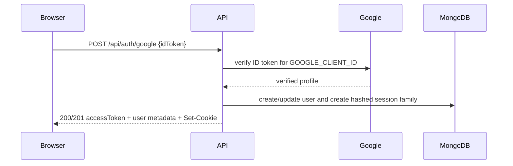

# Google Authentication

Google sign-in uses the same cookie-based session model documented in [authentication.md](./authentication.md).

## Flow

1. The browser obtains a Google ID token.
2. It sends `{ "idToken": "<google-id-token>" }` to `POST /api/auth/google`.
3. The API verifies the token with `GOOGLE_CLIENT_ID` and reads the Google subject, email, name, avatar URL, and email-verification flag.
4. The API finds the user by Google provider ID or email. It creates a customer for a new identity or updates the linked profile and `lastLoginAt` for an existing identity.
5. The API creates an independent refresh-token family. IP address and user agent are recorded only as observational metadata; Google login does not revoke sessions by IP.
6. The response returns `message`, `accessToken`, `isNewUser`, and `user`. It never returns `refreshToken`; that credential is set as the `HttpOnly` `refreshToken` cookie.

## Responses

- `201 Created`: a new Google-backed user was created.
- `200 OK`: the existing user logged in.
- `400 Bad Request`: `idToken` is missing, structurally invalid, expired, has an invalid signature/issuer/audience, or lacks required profile fields.
- `409 Conflict`: the email and Google subject resolve to conflicting or ambiguous existing identities.
- `500 Internal Server Error`: operational infrastructure failed, including missing `GOOGLE_CLIENT_ID`, MongoDB lookup/persistence, or session creation.

The Google library exposes token-validation and certificate/network failures through overlapping error types. The verifier therefore maps only its identifiable signed-token validation failures to `400`. Module loading, configuration, certificate retrieval, network/upstream, and unknown verifier failures remain `500`; it does not broadly classify errors by words such as `invalid`.

The access token follows `JWT_ACCESS_EXPIRES_IN` (default `15m`) and belongs in frontend memory. The refresh cookie and hash-only Mongo session follow `JWT_REFRESH_EXPIRES_IN` (default `7d`). Production cookie, CORS, exact `FRONTEND_ORIGINS`, HTTPS, refresh rotation, client startup, migration, and testing requirements are covered in the main authentication guide.
