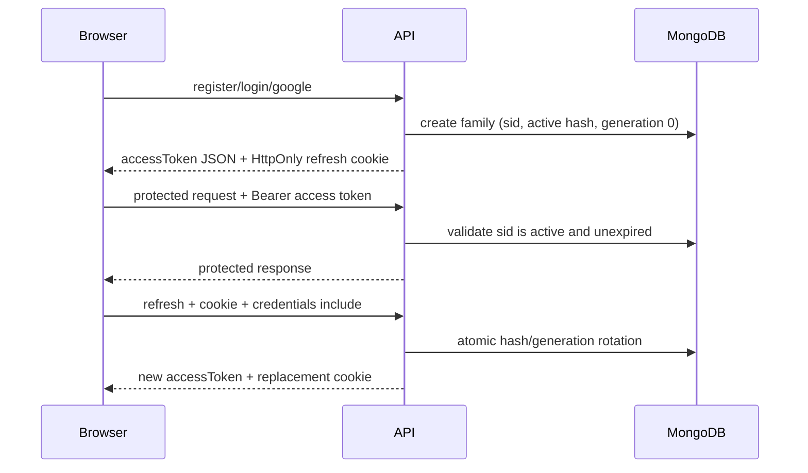
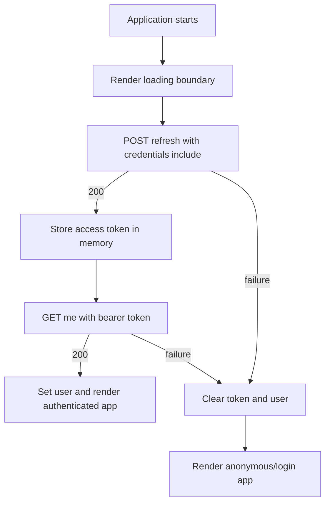

# Authentication and Sessions

The API uses short-lived JWT access tokens and rotating refresh-token sessions. Access tokens are returned in JSON and should exist only in frontend memory. Refresh tokens are never returned in JSON: the API sends them in an `HttpOnly` cookie and stores only SHA-256 hashes in MongoDB.

## Configuration

| Variable | Default | Purpose |
| --- | --- | --- |
| `JWT_ACCESS_SECRET` | none | Required access-token signing secret. |
| `JWT_REFRESH_SECRET` | none | Required, separate refresh-token signing secret. |
| `JWT_ACCESS_EXPIRES_IN` | `15m` | Access-token lifetime. |
| `JWT_REFRESH_EXPIRES_IN` | `7d` | Refresh-token, cookie `Max-Age`, and Mongo session lifetime. Supports `ms`, `s`, `m`, `h`, or `d` values representing an exact whole number of seconds, with a minimum of one second. |
| `FRONTEND_ORIGINS` | empty outside production | Comma-separated exact browser origins. Required in production, for example `https://app.example.com,https://admin.example.com`; no paths, wildcards, or trailing slashes. |
| `REDIS_URL` | `redis://localhost:6379` | Redis connection used for session-validation hints. |
| `SESSION_CACHE_TTL_SECONDS` | `300` | Maximum Redis hint lifetime. |
| `AUTH_SESSION_CACHE_TIMEOUT_MS` | `100` | Positive timeout for Redis connection and command work. |
| `AUTH_SESSION_CACHE_COOLDOWN_MS` | `1000` | Positive Redis bypass interval after an error or timeout. |

Use independent, securely generated JWT secrets in deployed environments. The `.env.example` values are non-secret placeholders.

## Credential Storage

- Access token: short-lived bearer credential, held in memory only and sent as `Authorization: Bearer <accessToken>`.
- Refresh token: `HttpOnly` cookie named `refreshToken`; JavaScript cannot read it.
- MongoDB: stores `refreshTokenHash` and `usedRefreshTokenHashes`, never a raw refresh token.
- IP address and user agent: observational session metadata only. They do not scope or revoke sessions.

The refresh cookie uses `Path=/api/auth` and a `Max-Age` equal to `JWT_REFRESH_EXPIRES_IN`. In development it uses `HttpOnly`, `SameSite=Lax`, and no `Secure` flag. In production it uses `HttpOnly`, `Secure`, and `SameSite=None`; production clients and the API must therefore use HTTPS.

## Browser, CORS, and CSRF

Browser calls that need the refresh cookie must set `credentials: "include"`. The API enables credentialed CORS only when the request `Origin` exactly matches an entry in `FRONTEND_ORIGINS`; it never combines credentials with a wildcard origin.

`SameSite=None` allows a production frontend and API on different sites. The CSRF defense for `POST /api/auth/refresh` and `POST /api/auth/logout` is a strict production `Origin` check: requests with a missing or non-matching origin receive `403`. This assumes browser traffic is HTTPS, reverse proxies preserve `Origin`, and `FRONTEND_ORIGINS` contains only trusted application origins. Non-browser clients must supply an allowed `Origin` in production for these routes.

## Session Lifecycle



Each login creates an independent session family with a stable Mongo `_id`. That ID is the `sid` claim in both token types. A successful refresh atomically requires the current hash and generation, moves the old hash to `usedRefreshTokenHashes`, increments `generation`, stores the replacement hash, and extends expiry from the replacement token.

Reusing any historical refresh token revokes the entire stable family by setting `revokedAt`. The current refresh token and every access token carrying that `sid` then fail immediately. Two concurrent refreshes with the same cookie have exactly one winner; the loser is detected as reuse and revokes the family, so the winner's newly issued credentials are also no longer usable. Clients prevent normal concurrency with one shared refresh promise.

Access-token authentication is stateful: signature and expiry are checked, then MongoDB validates the token's `sid`, `userId`, expiry, and absence of `revokedAt`. Logout and reuse revocation therefore invalidate access immediately rather than waiting for the JWT lifetime.

## Startup Index Synchronization

On a successful database connection the API calls `syncIndexes()` for every registered model. This aligns the live collections with the current schemas and, crucially, drops obsolete indexes left behind by past schema changes. A stale unique index on the removed session `refreshToken` field previously caused every session document to share a `null` value, so only the first login could persist a session and any later login failed with an `E11000 duplicate key` `500`. Synchronizing indexes at startup removes that index and prevents the class of failure.

Set `DB_SYNC_INDEXES=false` to skip synchronization (for example against very large collections where index rebuilds must be scheduled manually). Synchronization failures are logged and never block startup.

Logout clears the browser cookie on every call. Missing, malformed, already revoked, or unknown credentials are idempotent and return `204`. If a parseable token identifies a session but MongoDB revocation fails, the cookie is still cleared and the operational failure returns `500`.

## Redis Fallback

MongoDB is authoritative on every protected request. Redis entries are hints containing `sessionId`, `userId`, and `expiresAt`; a Redis hit never authorizes by itself. Valid Mongo sessions are written with `min(remaining lifetime, SESSION_CACHE_TTL_SECONDS)`.

Malformed JSON, wrong runtime types, mismatched IDs, non-finite timestamps, and expired hints are invalidated best-effort before MongoDB validation continues. Redis connection errors, command errors, and timeouts are logged and fall back to MongoDB. A failure opens `AUTH_SESSION_CACHE_COOLDOWN_MS`; during cooldown Redis is bypassed immediately, and a later successful operation resets the cooldown. Writes and invalidations on rotation, revocation, and logout are also best-effort, so stale Redis data cannot authorize a revoked Mongo session.

## Endpoints and Statuses

| Endpoint | Credential/input | Success |
| --- | --- | --- |
| `POST /api/auth/register` | JSON email, password (at least 8 characters), and non-empty trimmed name; all required | `201`, access token/user JSON, refresh cookie |
| `POST /api/auth/login` | JSON email/password | `200`, access token/user JSON, refresh cookie |
| `POST /api/auth/google` | JSON Google `idToken` | `200` existing or `201` new, Google metadata/access token/user JSON, refresh cookie |
| `POST /api/auth/refresh` | Refresh cookie; no JSON body | `200`, only `accessToken` JSON, replacement refresh cookie |
| `POST /api/auth/logout` | Optional refresh cookie; no JSON body | `204`, cleared refresh cookie |
| `GET /api/auth/me` | Bearer access token | `200`, user JSON |

Expected errors use the centralized `{ success, status, message, requestId? }` shape:

- `400 Bad Request`: malformed or missing validation input, including invalid Google input.
- `401 Unauthorized`: missing/invalid credentials, expired access or refresh token, unknown/revoked session, or refresh reuse.
- `403 Forbidden`: untrusted production origin or insufficient authorization where applicable.
- `409 Conflict`: duplicate registration identity or conflicting/ambiguous Google identity matches.
- `500 Internal Server Error`: operational failures such as session persistence/revocation or Google verification infrastructure.

A refresh `401` clears the refresh cookie. A production origin rejection occurs before refresh/logout controller cookie handling and does not alter the cookie.

## Framework-Neutral TypeScript Client

```ts
interface IUser {
  id: string;
  email: string;
  name?: string;
  role: "admin" | "customer";
  authProvider: "local" | "google";
}

interface IAuthConfig {
  apiBaseUrl: string;
  loginUrl: string;
}

interface IAuthUi {
  renderLoading(): void;
  renderAnonymous(): void;
  renderAuthenticated(user: IUser): void;
  navigateToLogin(url: string): void;
}

type AuthState =
  | { status: "loading" }
  | { status: "authenticated"; user: IUser }
  | { status: "anonymous" };

// Inject these values from deployment configuration. Do not assume a same-origin API.
const authConfig: IAuthConfig = {
  apiBaseUrl: "https://api.example.com",
  loginUrl: "/login"
};

const authUi: IAuthUi = {
  renderLoading: () => {
    document.body.textContent = "Loading...";
  },
  renderAnonymous: () => {
    document.body.textContent = "Please sign in";
  },
  renderAuthenticated: (user) => {
    document.body.textContent = `Signed in as ${user.email}`;
  },
  navigateToLogin: (url) => {
    window.location.assign(url);
  }
};

let accessToken: string | null = null;
let authState: AuthState = { status: "loading" };
let refreshPromise: Promise<boolean> | null = null;

function getAuthState(): AuthState {
  return authState;
}

function setAnonymous(): void {
  accessToken = null;
  authState = { status: "anonymous" };
}

async function refreshAccess(): Promise<boolean> {
  refreshPromise ??= fetch(`${authConfig.apiBaseUrl}/api/auth/refresh`, {
    method: "POST",
    credentials: "include"
  }).then(async (response) => {
    if (!response.ok) return false;
    accessToken = ((await response.json()) as { accessToken: string }).accessToken;
    return true;
  }).catch(() => false).finally(() => {
    refreshPromise = null;
  });

  const refreshed = await refreshPromise;
  if (!refreshed) {
    setAnonymous();
  }
  return refreshed;
}

async function apiFetch(path: string, init: RequestInit = {}, retried = false): Promise<Response> {
  const headers = new Headers(init.headers);
  if (accessToken) headers.set("Authorization", `Bearer ${accessToken}`);

  const response = await fetch(`${authConfig.apiBaseUrl}${path}`, {
    ...init,
    headers,
    credentials: "include"
  });
  if (response.status !== 401 || retried) return response;
  if (!(await refreshAccess())) return response;
  return apiFetch(path, init, true);
}

async function initializeAuth(): Promise<void> {
  authState = { status: "loading" };

  try {
    if (!(await refreshAccess())) return;

    const response = await apiFetch("/api/auth/me", {}, true);
    if (!response.ok) {
      setAnonymous();
      return;
    }

    const { user } = (await response.json()) as { user: IUser };
    authState = { status: "authenticated", user };
  } catch {
    setAnonymous();
  }
}

async function logout(): Promise<void> {
  try {
    await fetch(`${authConfig.apiBaseUrl}/api/auth/logout`, {
      method: "POST",
      credentials: "include"
    });
  } finally {
    setAnonymous();
    authUi.navigateToLogin(authConfig.loginUrl);
  }
}

function renderApplication(): void {
  const state = getAuthState();
  if (state.status === "loading") return authUi.renderLoading();
  if (state.status === "anonymous") return authUi.renderAnonymous();
  authUi.renderAuthenticated(state.user);
}

authUi.renderLoading();
void initializeAuth().then(renderApplication).catch(() => {
  setAnonymous();
  renderApplication();
});
```

Keep bearer injection in this single fetch wrapper. Replace `authConfig.apiBaseUrl` from deployment configuration with the API's absolute origin; this is required when the frontend and API are deployed on different origins. Refresh and logout use `credentials: "include"`. The shared promise coalesces simultaneous `401` responses. The refresh request uses `fetch` directly, so it cannot recursively trigger refresh. Retry the original request once only. Failed refresh clears token/user state. Logout is best-effort and always clears local state before navigating to login.

At application startup, render a loading boundary before awaiting any network request, call refresh, then call `/api/auth/me` through the authenticated client. Enter authenticated state only if both succeed; otherwise catch refresh/profile exceptions, clear state, and enter anonymous mode. The top-level invocation also handles rejection before selecting the final render as a last-resort boundary. Do not render protected routes until loading completes, which prevents protected-content flash.



## Migration

This model has no runtime migration for legacy raw-token sessions. Before deploying, invalidate all existing sessions by deleting the `Session` collection/documents; every user must authenticate again. Configure exact `FRONTEND_ORIGINS`, deploy frontend and API over HTTPS, and use new independent secrets if legacy refresh credentials may have leaked.

## OpenAPI and Tests

The OpenAPI 3.0 document is available at `GET /openapi.json`.

With local MongoDB and Redis available:

```sh
MONGO_INITDB_DATABASE=mongodb://127.0.0.1:27017/rusticone-test REDIS_URL=redis://127.0.0.1:6379 npm run test:local
npm run typecheck
npm run lint
```

Run the complete isolated integration stack with Docker:

```sh
npm test
```
