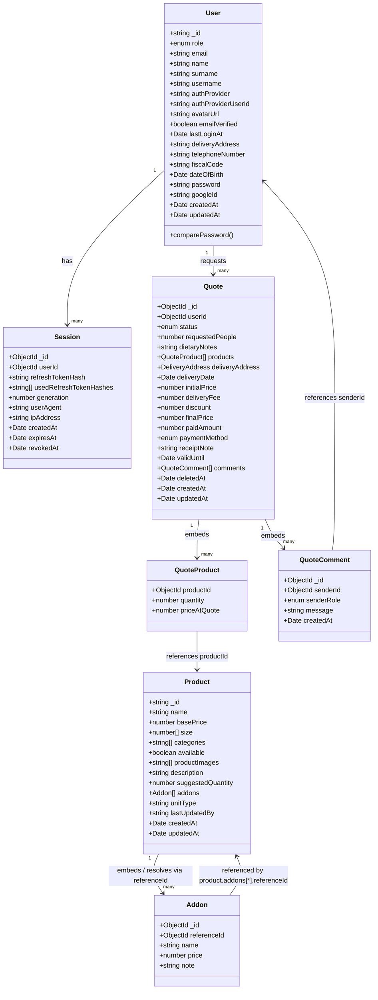

# Models map

This document reflects the MongoDB collections currently modeled in the project and their main properties.

> Keep this file updated whenever a new model is added or an existing schema is changed, removed, or renamed.

## Collection details

### User
- Main authentication and profile collection.
- Used by local and Google auth flows.
- Fields include identity, role, auth metadata, and timestamps.
- `email`: required, unique, trimmed, lowercased, and validated with the shared basic email pattern `^[^\s@]+@[^\s@]+\.[^\s@]+$`; standard plus-addresses are accepted.

### Session
- Stores one stable refresh-token family per authenticated session; raw tokens are never persisted.
- `_id`: stable family/session `ObjectId`; used as the token `sid` claim.
- `userId`: required `ObjectId` reference to `User`; indexed.
- `refreshTokenHash`: required, unique SHA-256 hash of the active refresh token; unique index.
- `usedRefreshTokenHashes`: string array, default `[]`; historical hashes used for replay detection.
- `generation`: required non-negative number, default `0`; atomically increments on rotation.
- `userAgent`: optional observational string.
- `ipAddress`: optional observational string; indexed, but never used for authorization or revocation.
- `createdAt`: date with `Date.now` default. The schema does not use automatic timestamps.
- `expiresAt`: required date with TTL index `expireAfterSeconds: 0`.
- `revokedAt`: optional date; its presence invalidates the complete family.
- Each access token is bound to a session `_id` via its `sid` claim.
- Schema `versionKey` is disabled.

### Product
- Represents a menu product.
- `categories` is constrained to the product category enum.
- `size` is an array of numeric values.
- `addons` is an array of addon objects, usually resolved from referenced addon records.
- Timestamps are enabled via `timestamps: true`.

### Addon
- Represents a selectable extra option for products.
- `referenceId` is an ObjectId used to connect to related addon records when resolved.
- Used as a child resource inside product addon payloads.

### Quote
- Represents a catering quote requested by a customer.
- `userId` references the `User` collection and is indexed.
- `status` is constrained to the quote status enum and drives the workflow (`pending`, `quoted`, `confirmed`, `rejected`, `completed`, `cancelled`); it is indexed.
- `products` embeds `QuoteProduct` subdocuments; `priceAtQuote` is a server-side snapshot of the product `basePrice` at creation and is never accepted from clients.
- `deliveryAddress` is an embedded object; `deliveryDate` is indexed.
- Pricing (`initialPrice`, `finalPrice`) is always computed server-side: `sum(priceAtQuote * quantity) + deliveryFee`, then minus `discount`.
- `comments` embeds `QuoteComment` subdocuments; `senderId`/`senderRole` are derived from the authenticated user.
- `deletedAt` implements soft deletion; records are retained and excluded from all reads. Indexed.
- Timestamps are enabled via `timestamps: true`.
