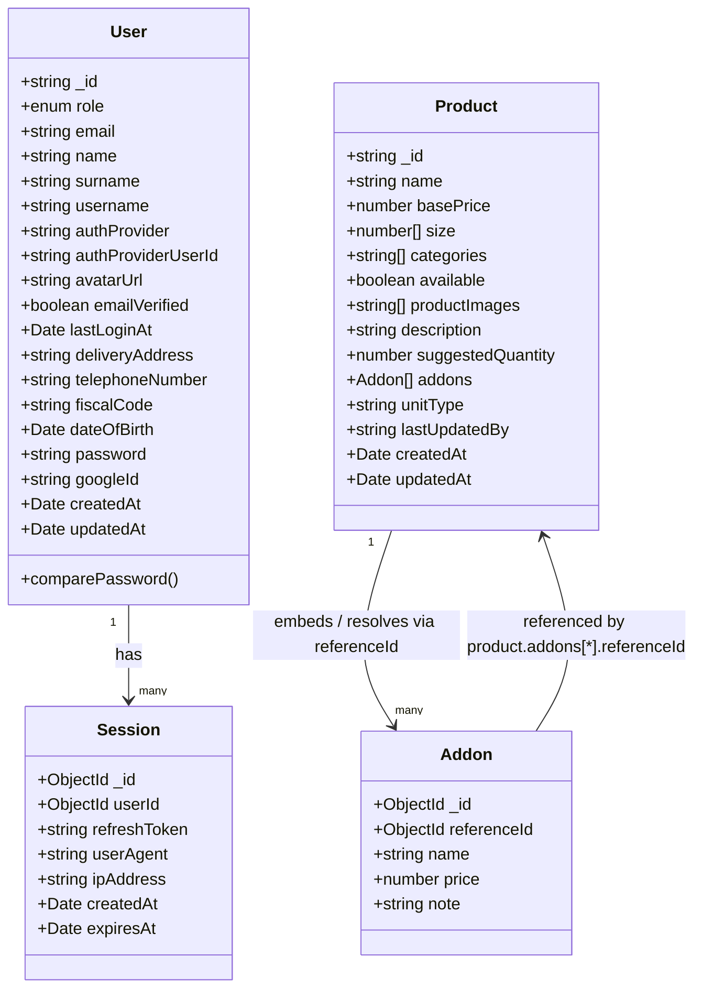

# Models map

This document reflects the MongoDB collections currently modeled in the project and their main properties.

> Keep this file updated whenever a new model is added or an existing schema is changed, removed, or renamed.

## Collection details

### User
- Main authentication and profile collection.
- Used by local and Google auth flows.
- Fields include identity, role, auth metadata, and timestamps.

### Session
- Stores refresh tokens for authenticated users.
- `userId` references the `User` collection and is indexed.
- `ipAddress` is indexed to support revoking a user's sessions from other IPs on login.
- Each access token is bound to a session `_id` via its `sid` claim.
- `expiresAt` is configured to expire automatically.

### Product
- Represents a menu product.
- `categories` is constrained to the product category enum.
- `size` is an array of numeric values.
- `addons` is an array of addon objects, usually resolved from referenced addon records.
- Timestamps are enabled via `timestamps: true`.

### Addon
- Represents a selectable extra option for products.
- `referenceId` is an ObjectId used to connect to related addon records when resolved.
- Used as a child resource inside product addon payloads.
